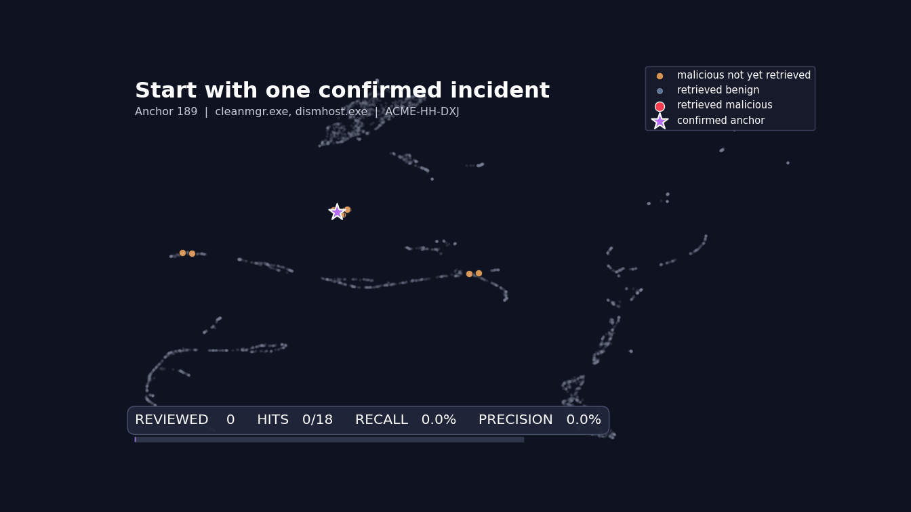
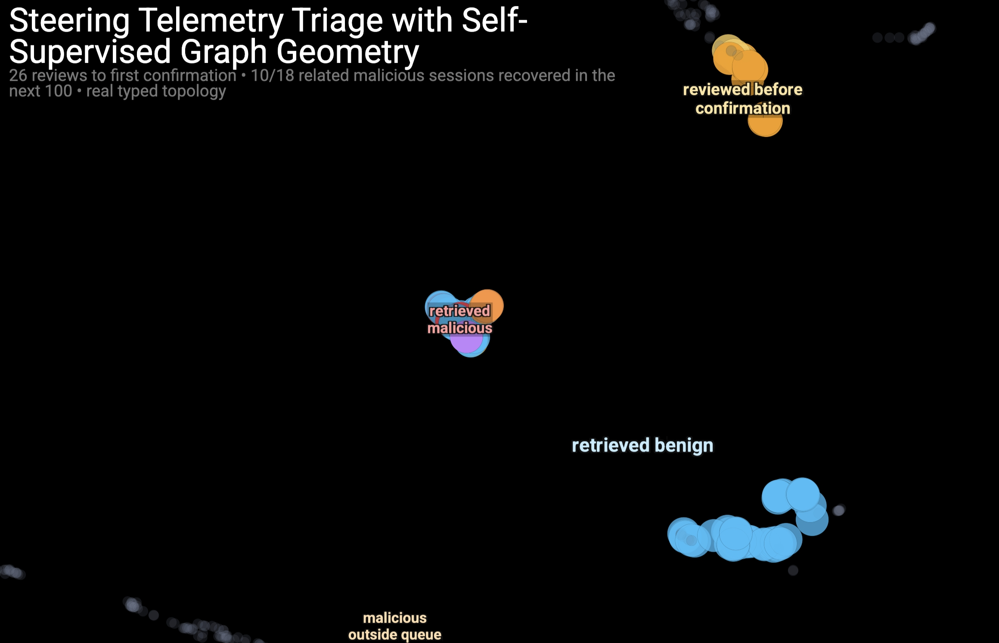

# Steering Telemetry Triage with Self-Supervised Graph Geometry

**Main Objective:** Help analysts progressively steer telemetry session visualizations to reveal sessions likely to be malicious

**The Key Question**
If we confirm ONE malicious session, can we find the others?

This is **few-shot triage.** One confirmed incident (manually or suggested agentically) becomes a seed to pull back the related ones.

---

# 1. Data

- ACME4 gold process telemetry (train-process_uber_summary.paraquet)
- One slice: 100k processes from a late chronological window
- Each process has: pid_hash, user, host, executable, parent, file touches, timestamps
- Labels (red-team flag) exist but are only used for evaluation, never for training

# 2. Graph Representation

- Heterogenous graph
- Different node and edge types
- Model will learn to handle different relations differently (message passing)

### Graph Nodes

- Processes - each process is represented by a node in the graph
- Rare files - files that appear only 2-15 times by a process
    - Common files are too generic and cause unnecessary noise

### Graph Edge Types

| Relation | Connects | Why |
| --- | --- | --- |
| `parent_child` | Process → process | Spawn lineage (A spawned B) |
| `touches` | Process → file | A read or wrote F |
| `same_user_time_window` | Process ↔ process | Same user within 5 min |
| `same_host_time_window` | Process ↔ process | Same host within 5 min (if user unknown) |
| File-to-file linkage | File ↔ file | Shared process that touched both |
- **Sessions**: grouped by identity, **split after 5 min of inactivity or
30 min total duration. T**his bounds session size and prevents transitive multi-day blobs.
- A session is labeled **malicious** if any process in it carries the red-team flag.

# **3. Evaluation Protocol**

- **Real-vs-shuffled control**
    - Same graph topology, edges shuffled
    - Isolates if *real structure* matters vs just having edges
- **Feature ablation**
    - Which part of the handcrafted baseline carries signal (node telemetry vs
    session size vs edge counts)
- **Label-shuffle control**
- **Leave-one-anchor-out retrieval**
    - Every malicious session is the query anchor exactly once the anchor is removed from evaluation
- **Paired Wilcoxon tests** across all anchors vs each control

## Experiments

| Method | What it tests |
| --- | --- |
| `graph_stats` | Handcrafted session aggregates — the minimum bar |
| `node_stats_baseline` | Raw process telemetry, no graph |
| `sage_real_full` | Learned embeddings, all real edges |
| `sage_real_no_host` | **Final model** — real edges minus the noisy same-host relation |
| `sage_shuffled_no_host` | Matched topology control (shuffled edges) |
| One-anchor cosine retrieval | The few-shot steering experiment |
| Discovery → steering | Label-free way to *find* the first anchor (exploratory) |

## Results

**1. Structure matters (grouping)**

- Removing the same-host relation improved real-edge separation to **0.195 ± 0.019**, vs.
**0.052 ± 0.023** for the matched shuffled-edge control; full real graph **0.176 ± 0.011**.
- → The grouping benefit comes from **real typed topology**, not from edge count or the dense
same-host relation.
**2. As a standalone anomaly detector, the graph is *not* the winner (honest negative)**
- Raw node statistics remain the better **global outlier** detector — recovering **73.7%** of
malicious sessions in the top 10% by distance.
- The learned embedding's strength is **local neighborhood coherence**, not global ranking.
**3. Few-shot steering (the headline)**

With one confirmed malicious session as the anchor, ranking all others by cosine similarity:

| Representation | Average Precision | Recall@100 |
| --- | --- | --- |
| **Real SAGE (no-host)** | **0.1396 ± 0.0917** | **0.4659 ± 0.2624** |
| Raw node statistics | 0.0660 | 0.2719 |
| Shuffled-edge SAGE | 0.0308 | 0.1121 |
| Random ranking | 0.0058 | 0.0319 |
- Paired one-sided Wilcoxon over all malicious anchors: **p < 0.0005** against both controls,
for AP and recall@100.
**4. End-to-end, label-free discovery → steering (exploratory)**

"Where does the first anchor come from?" 

- Using labels only to *simulate* the analyst's confirmation:

| Stage | Real graph | Raw anomaly baseline | Shuffled-graph control |
| --- | --- | --- | --- |
| Reviews to first confirmed anchor (lower is better) | **26** | 86 | 67 |
| Related malicious recovered in next 100 reviews | **10 / 18** | 3 / 18 | 1 / 18 |
- The graph-derived "stable regions" find a confirmable incident
    - ~3× faster than sorting by raw anomaly score, and the steered queue then recovers the majority of remaining malicious sessions
    - Treated as **exploratory**
 

**STAMP Takeaway**

- *Self-supervised relational learning produces a malicious-session geometry that is weak for unsupervised outlier ranking but strongly amplifies a single analyst-confirmed example into retrieval of related malicious activity.*

## Limitations

- **Only 19 malicious sessions**, from **one ACME time slice**
- High variance: recall@100 std (±0.26) is more than half the mean — some anchors retrieve very little.
- The **discovery stage** beats the baselines *on this slice*, but is **exploratory.** The result is a single deterministic realization - must be frozen and re-tested on a holdout before being trusted.
- This is a **few-shot triage** result, **not** an unsupervised anomaly-detection or zero-shot claim.
